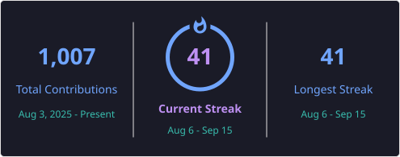

<div align="center">

# 👋 Hey, I'm **Piyush Jain**

### 🤖 AI/ML Engineer • Full-Stack Developer • Open-Source Builder

<p>
  <em>Turning ambitious ideas into intelligent, production-ready products.</em>
</p>

<br/>

<a href="https://piyush-jain-portfolio.vercel.app">
  
</a>
<a href="https://linkedin.com/in/piyushjain1857">
  
</a>
<a href="https://leetcode.com/u/piyushjain1857/">
  
</a>
<a href="mailto:piyushjain1857@gmail.com">
  
</a>

<br/><br/>


</div>

---

## 🧠 About Me

<table>
<tr>
<td width="55%" valign="top">

### Building at the intersection of AI & software

I'm a **B.Tech CSE student specializing in AI/ML**, focused on building practical systems that combine intelligent models with polished user experiences.

- 🔭 Building **AI-first products**
- 🧠 Exploring **LLMs, AI Agents & Computer Vision**
- ⚙️ Designing **scalable backend architectures**
- ☁️ Learning **Kubernetes & distributed systems**
- 🌱 Improving through **DSA + open source**
- 🎯 Goal: build software that is **useful, scalable and production-ready**

</td>
<td width="45%" valign="top">

### ⚡ Quick Snapshot

```text
Role        → AI/ML + Full Stack
Focus       → GenAI • Backend • Systems
Languages   → Python • JavaScript • SQL
Frontend    → React • Next.js
Backend     → FastAPI • Node.js • Express
Data        → PostgreSQL • MySQL
AI/ML       → TensorFlow • LLMs • CV
DevOps      → Git • Linux • Docker • Kubernetes
```

</td>
</tr>
</table>

---

## 🚀 What I'm Building

<table>
<tr>
<td width="50%" valign="top">

### 🤖 CURIO AI

> Adaptive AI-powered learning platform

Personalized quizzes, intelligent feedback, weak-topic detection and learning recommendations.

**Stack:** `Next.js` `FastAPI` `Python` `MongoDB`

</td>
<td width="50%" valign="top">

### 🌾 Agro AI

> AI assistant for smarter farming

Computer vision + conversational AI for crop disease detection, diagnostics and agricultural assistance.

**Stack:** `Python` `TensorFlow` `FastAPI` `React`

</td>
</tr>

<tr>
<td width="50%" valign="top">

### 🎤 AI Interview Platform

> Automated interview simulation & evaluation

Real-time interview workflows with speech-to-text and AI-assisted candidate evaluation.

**Stack:** `Next.js` `TypeScript` `Express` `Node.js`

</td>
<td width="50%" valign="top">

### 🏫 Hostel Leave System

> Digital institutional workflow platform

A streamlined system for managing student leave requests, approvals and administrative workflows.

**Stack:** `React` `Node.js` `MySQL` `Docker`

</td>
</tr>
</table>

---

## 🛠️ Tech Arsenal

<div align="center">

### Languages & Core


### Frontend & Backend


### AI / Data / Databases


### Tools & Infrastructure


</div>

---

## 📊 GitHub Analytics

<div align="center">


&nbsp;&nbsp;


<br/><br/>



<br/><br/>


</div>

---

## 🏆 Achievements

<div align="center">


</div>

---

## 🐍 Contribution Snake

<div align="center">

<picture>
  <source
    media="(prefers-color-scheme: dark)"
    srcset="https://raw.githubusercontent.com/Piyushjain1857/Piyushjain1857/output/github-contribution-grid-snake-dark.svg"
  />
  <source
    media="(prefers-color-scheme: light)"
    srcset="https://raw.githubusercontent.com/Piyushjain1857/Piyushjain1857/output/github-contribution-grid-snake.svg"
  />
  
</picture>

</div>

---

## 🎯 2026 Focus

<div align="center">

| Focus | Goal |
| :--- | :--- |
| 🧠 **Generative AI** | LLMs, RAG, AI Agents & model workflows |
| ⚙️ **Backend Engineering** | APIs, microservices & scalable architectures |
| ☁️ **Cloud & DevOps** | Docker, Kubernetes & distributed systems |
| 🧩 **DSA** | Consistent problem solving & stronger fundamentals |
| 🌍 **Open Source** | Meaningful contributions to real-world projects |
| 🚀 **Product Building** | Ship useful AI products from idea → production |

</div>

---

## 📈 Developer Mindset

<div align="center">

> **Learn → Build → Break → Debug → Improve → Ship**

<br/>


</div>

---

## 🌐 Let's Connect

<div align="center">

<a href="https://piyush-jain-portfolio.vercel.app">
  
</a>
<a href="https://linkedin.com/in/piyushjain1857">
  
</a>
<a href="https://leetcode.com/u/piyushjain1857/">
  
</a>

<br/><br/>


<br/><br/>

### ⭐ Thanks for visiting!

**Let's build something extraordinary. 🚀**

</div>
